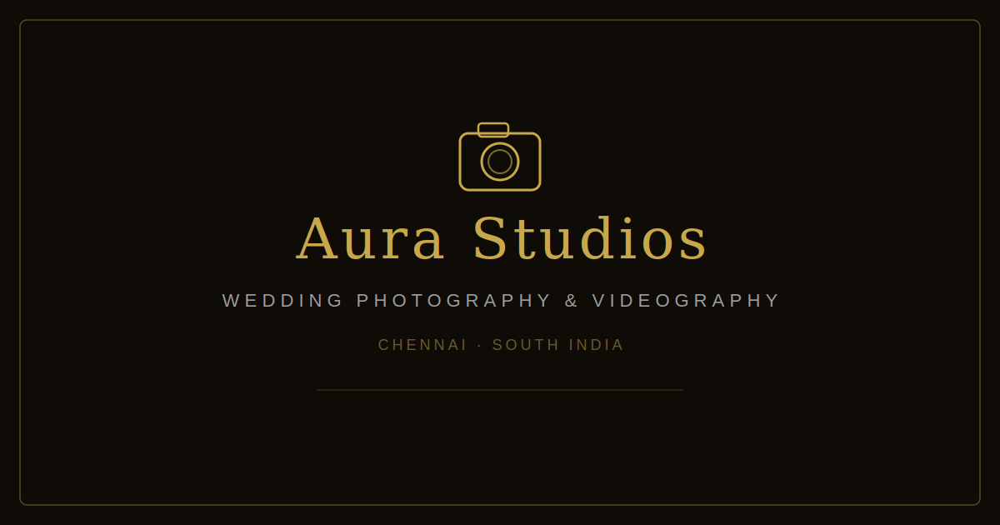

# 📸 Aura Studios — South Indian Wedding Photography & Videography

> Crafting timeless wedding stories through the lens of South Indian tradition and elegance.



---

## 🌟 About the Project

**Aura Studios** is a professional portfolio website for a South Indian wedding photography and videography studio based in **Chennai, Tamil Nadu**. The site showcases the studio's work, services, and story — built to attract couples planning their dream South Indian wedding.

The project was built as a modern, responsive single-page-application with cinematic aesthetics, smooth animations, and mobile-friendly design.

---

## 👥 Who This Is Useful For

| Audience | Why It's Relevant |
|---|---|
| **Wedding photographers & videographers** | A ready-to-use professional portfolio template |
| **Photography studios** | Multi-page website structure with Services, Portfolio, About, and Contact pages |
| **Freelancers** | Clean, fast, deployable web presence with zero backend required |
| **Web developers** | Reference for React + Tailwind + Framer Motion animation patterns |
| **Couples / clients** | Book consultations, browse portfolio, view pricing, and contact the studio |

---

## ✨ Features

- 🎬 **Cinematic Hero Section** — Full-screen wedding imagery with animated text overlays
- 🖼️ **Portfolio Gallery** — Masonry grid with category filters (Weddings, Events, Portraits, Reels) and lightbox
- 🎥 **Video Showcase** — Embedded YouTube videos with custom play button overlay
- 📋 **Services Page** — Photography packages with pricing in Indian Rupees
- 👤 **About Page** — Studio story, lead photographer profile, and milestone timeline
- 📬 **Contact Page** — Full enquiry form with WhatsApp floating button
- 💬 **Testimonials** — Client quotes from real couples across Tamil Nadu
- 📱 **Fully Responsive** — Mobile-first design with animated mobile nav menu
- ♿ **Accessible** — ARIA labels, semantic HTML, keyboard navigable

---

## 🛠️ Tech Stack

| Technology | Purpose |
|---|---|
| **React 18** | UI framework |
| **TypeScript** | Type safety |
| **Vite** | Build tool & dev server |
| **Tailwind CSS** | Utility-first styling |
| **shadcn/ui** | Accessible component primitives |
| **Framer Motion** | Page and scroll animations |
| **React Router DOM** | Client-side routing |
| **Lucide React** | Icon library |

---

## 📁 Project Structure

```
golden-hour-studio-main/
├── public/
│   ├── favicon.svg          # Camera SVG favicon (gold, Aura Studios branding)
│   ├── favicon.ico          # Fallback favicon for older browsers
│   ├── og-image.svg         # Open Graph social share card
│   └── robots.txt
├── src/
│   ├── assets/              # All local images (wedding, portraits, events etc.)
│   ├── components/
│   │   ├── ui/              # shadcn/ui component library (button, card, dialog, etc.)
│   │   ├── Navbar.tsx       # Responsive top navigation with mobile drawer
│   │   ├── Footer.tsx       # Footer with links, contact info & social icons
│   │   ├── SplashScreen.tsx # Animated loading splash screen
│   │   └── WhatsAppButton.tsx # Floating WhatsApp CTA button
│   ├── pages/
│   │   ├── Index.tsx        # Home page (hero, featured moments, videos, testimonials, CTA)
│   │   ├── About.tsx        # Studio story, photographer profile, timeline
│   │   ├── Services.tsx     # Photography & videography packages with pricing
│   │   ├── Portfolio.tsx    # Filterable masonry gallery with lightbox
│   │   ├── Contact.tsx      # Enquiry form and contact details
│   │   └── NotFound.tsx     # 404 page
│   ├── hooks/               # Custom React hooks
│   ├── lib/                 # Utility helpers (e.g. cn() class merger)
│   ├── App.tsx             # Root app with routing
│   ├── main.tsx            # React DOM entry point
│   └── index.css           # Global styles + Tailwind directives
├── index.html              # HTML shell with SEO meta tags & favicon
├── tailwind.config.ts      # Custom gold colour palette & font configuration
├── vite.config.ts          # Vite build & dev server configuration
├── tsconfig.json           # TypeScript configuration
└── package.json            # Dependencies and npm scripts
```

---

## 🚀 Getting Started

### Prerequisites

- [Node.js](https://nodejs.org/) v18 or higher
- npm (comes with Node.js)

### Installation

```sh
# 1. Clone the repository
git clone <YOUR_GIT_URL>

# 2. Navigate to the project directory
cd golden-hour-studio-main

# 3. Install dependencies
npm install

# 4. Start the development server
npm run dev
```

Open [http://localhost:8080](http://localhost:8080) in your browser.

### Available Scripts

| Command | Description |
|---|---|
| `npm run dev` | Start development server with hot reload |
| `npm run build` | Production build (outputs to `dist/`) |
| `npm run preview` | Preview the production build locally |
| `npm run lint` | Run ESLint checks |
| `npm test` | Run unit tests with Vitest |

---

## 📄 Pages

| Route | Page | Description |
|---|---|---|
| `/` | Home | Hero, Featured Moments, Video Showcase, Testimonials, CTA |
| `/about` | About | Studio story, lead photographer profile, milestone timeline |
| `/services` | Services | 5 service packages with descriptions and starting prices |
| `/portfolio` | Portfolio | Masonry gallery with category filter and lightbox viewer |
| `/contact` | Contact | Booking enquiry form + WhatsApp integration |

---

## 🎨 Colour Palette

| Name | Hex | Usage |
|---|---|---|
| Gold Primary | `#C9A84C` | Accents, highlights, brand colour |
| Gold Light | `#E8C76A` | Hover states and decorative elements |
| Gold Dark | `#A67C32` | Active / darker button states |
| Background | `#FDFAF5` | Page background (warm off-white) |
| Foreground | `#1A1208` | Dark text and overlays |

---

## 📦 Deployment

This is a static Vite + React app — you can deploy it to any static hosting provider:

- **Vercel**: `npx vercel` or connect GitHub repo
- **Netlify**: Drag & drop the `dist/` folder or connect GitHub
- **GitHub Pages**: Use `gh-pages` npm package

Build command: `npm run build`  
Output directory: `dist/`

---

## 📸 About the Studio

**Aura Studios** was founded in 2019 by **Vikram Sundaram** in Chennai, Tamil Nadu. The studio specialises in cinematic South Indian wedding documentation — capturing sacred rituals, candid emotions, and cultural nuances across Tamil Nadu, Kerala, Karnataka, and Andhra Pradesh.

---

## 📄 License

This project is intended as a portfolio demonstration. All wedding imagery used is for illustrative purposes.

© 2026 Aura Studios. All rights reserved.
